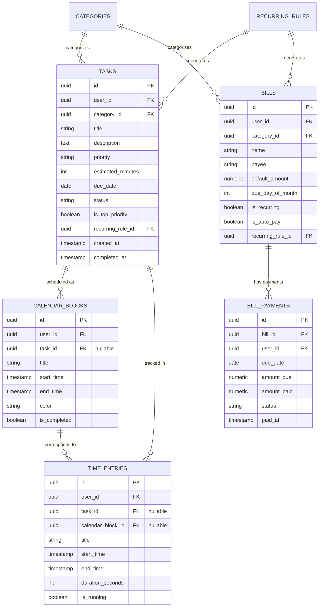
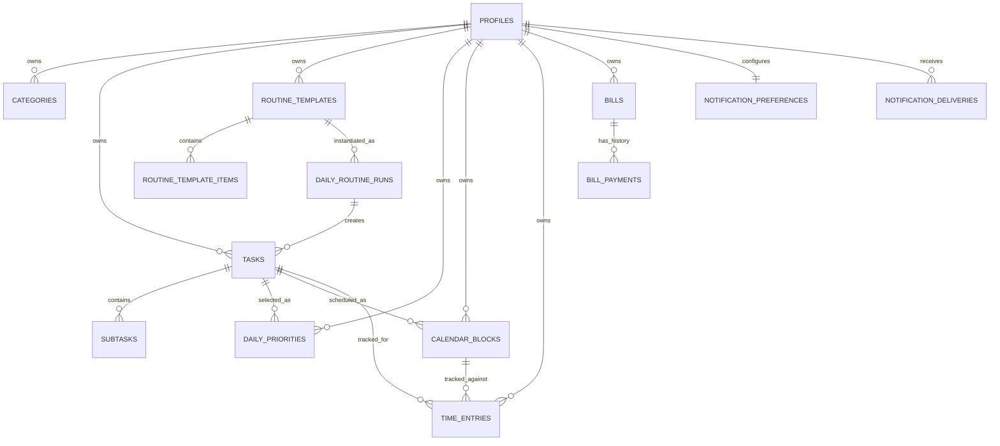

# Tracker Application - Comprehensive Project Plan & Architectural Blueprint

> **Status**: Source of Truth  
> **Version**: 1.2.0  
> **Author**: Senior Product Architect & Full-Stack Developer  
> **Target Stack**: Vite, React 19, TypeScript, Tailwind CSS, shadcn/ui, Lucide Icons, Supabase (PostgreSQL + Auth)

---

## 1. Product Definition & Core User Experience

### 1.1 Executive Summary
**Tracker** is an all-in-one personal productivity, time-management, and financial tracking web application designed specifically for individuals seeking a frictionless, engaging way to manage daily life. It bridges the gap between **task management**, **calendar time-blocking**, **actual time execution**, and **monthly bill management**.

Recognizing that traditional productivity tools often induce overwhelm for individuals with mild ADHD-related focus challenges, Tracker emphasizes:
- **Low cognitive load**: Quick single-shortcut task capture, constrained daily priorities ("Must-Win 3"), and distraction-free execution.
- **Routine continuity without recurrence complexity**: One-click Daily Routine Templates insert a saved morning, workday, or evening checklist into a selected day without creating an automatic recurrence engine.
- **Clarity over complexity**: A clear, immediate "What should I do right now?" hero view that eliminates decision paralysis.
- **Visual planning with fallbacks**: Tap-to-block and drag-and-drop make the common planner path fast; every drag action also has an accessible task-picker/form alternative.
- **Closing the intention-vs-reality loop**: Seamless visual comparison of planned time blocks versus actual tracked time.
- **Financial peace of mind**: Transparent, zero-friction monthly bill tracking with chronological due-date visibility and recurring payment histories (without complex banking open-API integrations).

---

## 2. Technology Stack & Architectural Decisions

### 2.1 Technology Matrix & Rationale

| Category | Recommended Technology | Primary Purpose & Rationale |
| :--- | :--- | :--- |
| **Frontend Core** | Vite + React 19 + TypeScript | Lightning-fast HMR, strict type safety across data schemas and API contracts, modern component architecture. |
| **Styling & Design System** | Tailwind CSS + `shadcn/ui` + `lucide-react` | Utility-first responsive styling, accessible Radix-UI primitive components, clean visual aesthetic with dark-mode support. |
| **Backend & Database** | **Supabase** (PostgreSQL) | Fully managed Postgres DB, native Row-Level Security (RLS) for multi-tenant data privacy, instant REST/Realtime APIs, built-in Auth. Outperforms MongoDB Atlas due to relational integrity between tasks, calendar blocks, time logs, and bill payments. |
| **Authentication** | Supabase Auth | Start with verified email/password and password reset. Add Magic Link or Google OAuth only if there is a demonstrated need. Supabase supplies the JWT used by RLS. |
| **State Management** | `@tanstack/react-query` + small local UI state | React Query is the source of truth for server data, caching, mutations, and invalidation. Use component state or a minimal Zustand store only for ephemeral UI state such as the sidebar, focus overlay, and timer display. |
| **Form Validation** | `react-hook-form` + `zod` | Declarative form handling with strict schema validation shared with TypeScript interfaces. |
| **Planner interaction** | `@dnd-kit/react` plus accessible native controls | Required drag-and-drop supports task-to-grid scheduling and block rescheduling. Tap-to-block, keyboard actions, and the edit form provide full feature parity on touch and assistive technology. |
| **Date Arithmetic** | `date-fns` + `@date-fns/tz` | Local-day formatting, explicit IANA-timezone conversion, time-slot calculations, and UI display. Bill month-end clamping stays in PostgreSQL `DATE` arithmetic. |
| **Notifications** | In-app alerts + scheduled email via Supabase Cron/Edge Functions and Resend | Email reminders protect against bills being missed when the app is closed. Browser timer notifications remain optional and permission-based; scheduled Web Push remains post-MVP. |
| **PWA & Offline** | `vite-plugin-pwa` (Workbox), later phase | An installable app shell can add mobile value. Cache only static application assets initially; do not promise offline writes or background synchronization without an explicit conflict-resolution design. |
| **Hosting & Deployment** | Vercel (Frontend) + Supabase Cloud (Backend) | Low-maintenance deployment for a solo developer. Confirm current quotas and pricing at deployment time rather than assuming a permanent free tier. |
| **Testing** | Vitest + React Testing Library + Playwright | Vitest for fast unit/integration tests; Playwright for end-to-end user flow verification. |

### 2.2 Deep Dive: Supabase vs. MongoDB Atlas
- **Why Supabase (PostgreSQL) is the Winner**:
  1. **Relational Integrity**: Tasks, Calendar Blocks, Time Entries, and Bills are inherently relational. Postgres foreign keys prevent orphaned time entries or broken bill histories.
  2. **Row-Level Security (RLS)**: Enforces privacy at the database layer (`WHERE user_id = auth.uid()`), ensuring personal financial and productivity data remains completely segregated and secure.
  3. **Complex Date & Interval Math**: PostgreSQL natively excels at `timestamptz` math, aggregations (`SUM(duration)` grouped by date/category), and window queries for financial summaries.
  4. **MongoDB Drawbacks**: Requires custom server backend or Realm/App Services, lacks native declarative RLS, and requires complex `$lookup` aggregations for joined productivity metrics.

---

## 3. Product Scope & Discipline

### 3.1 MVP Core Features (Included)
- [x] **Authentication**: Secure email/password login & registration.
- [x] **Task Engine**: Quick task creation (title, category, priority, estimated duration, due date), subtasks checklist, status workflow (`todo`, `in_progress`, `completed`).
- [x] **Daily Routine Templates**: Save a short ordered list of routine tasks and insert it into a selected day with one action; repeat taps are idempotent.
- [x] **ADHD Focus Suite**:
  - "What Should I Do Now?" hero widget.
  - "Must-Win 3" daily priority limit.
  - Simple focus timer / stopwatch.
  - Template-based Task Splitter (breaks big tasks into suggested 15-minute subtasks).
- [x] **Time Blocking Calendar**: Day-only 30-minute grid with tap-to-block creation, required drag-and-drop for task assignment and block movement, and keyboard/touch-friendly form editing as an equivalent fallback.
- [x] **Live Time Tracker**: One-click start/stop timer, manual time entry logging, and planned vs. actual time comparison widget.
- [x] **Bill Tracker**: One-time and monthly bill registry (name, amount, category, due date, auto-pay preference), variable monthly amount override, payment history log.
- [x] **Bill Calendar & Chronological Feed**: Visual calendar view of upcoming bills, monthly total due indicator, overdue warning banners.
- [x] **Bill Email Reminders**: Opt-in 8:00 AM local-time digest for bills due soon, due today, or overdue, with retry and duplicate-send protection.
- [x] **Basic Summaries**: Daily/weekly completion count, planned-versus-actual total, and monthly bill totals due/paid.
- [x] **Data Export**: Versioned JSON export of the user's own data.

### 3.2 Post-MVP Features (Explicitly Postponed)
- [ ] Direct banking / Plaid / Open-Banking integrations.
- [ ] Automated bank account transaction sync or automated bill payment processing.
- [ ] Multi-user collaboration, shared household bill splitting, or team workspaces.
- [ ] Complex multi-tiered gamification (avatars, shop systems, virtual currency).
- [ ] AI-driven task splitting or auto-scheduling.
- [ ] Automatic task-series recurrence, week/month planner views, advanced calendar recurrence, Kanban, and rich charts.
- [ ] Scheduled Web Push notifications, offline data mutation queues, and background synchronization. Scheduled email reminders are included in MVP.
- [ ] Native iOS/Android app store packages.

### 3.3 Pitfalls & Scope-Creep Warnings
1. **Overlapping Entities Pitfall**: Tasks, Calendar Blocks, and Time Entries can easily cause schema confusion. *Architectural Fix*: Strict 3-entity separation (see Section 5).
2. **Premature recurrence abstraction**: A shared generic recurrence engine makes "edit this occurrence" versus "edit future occurrences" ambiguous. *MVP Fix*: support one-time tasks, one-click Daily Routine Templates, one-time bills, and simple monthly bills; introduce automatic task series only with explicit occurrence semantics.
3. **Complex Timezone Skew**: A bill due date is a local calendar date, while a time entry is an instant. *Architectural Fix*: store an IANA timezone in the profile, store due dates as `DATE`, and store time blocks/time entries as UTC-backed `TIMESTAMPTZ` values displayed in that timezone.
4. **Offline-data risk**: Caching personal financial responses or silently queueing writes can expose data or create conflicts. *MVP Fix*: cache only static assets and show a clear offline state.

---

## 4. Main Pages & Navigation Structure

```
+-----------------------------------------------------------------------+
|  [Logo] Tracker              [Global Quick-Add +]  [Active Timer 00:24]
+-----------------------------------------------------------------------+
|  NAVIGATION SIDEBAR    |  MAIN CONTENT AREA                           |
|                        |                                              |
|  [⚡] Focus Now        |  Dynamic View depending on route:            |
|  [✓] Tasks & Inbox    |  - Focus Dashboard                           |
|  [📅] Daily Planner    |  - Day-only Time-Blocking Grid                |
|  [⏱] Time Logs         |  - Task List with Subtasks                     |
|  [💵] Bills & Finance  |  - Bill Calendar & Upcoming List             |
|  [📊] Analytics        |  - Basic Productivity & Spending Totals       |
|  [⚙] Settings         |                                              |
+-----------------------------------------------------------------------+
```

### 4.1 Route Breakdown
- `/` - **Focus Dashboard**: "What Should I Do Now?", "Must-Win 3" list, active timer controls, today's schedule snapshot.
- `/tasks` - **Task Center**: List view, quick add, subtask editor, Daily Routine Template editor/apply action, and category/priority filtering. Kanban is post-MVP.
- `/planner` - **Daily Planner**: Single-day time grid with tap-to-block, required task-to-grid/block drag-and-drop, keyboard controls, and form editing.
- `/time-logs` - **Actual Time Tracker**: Logged session history, manual time entry form, planned vs actual variance reports.
- `/bills` - **Bill Management**: Bill list, payment status updates, monthly budget overview, bill creation modal.
- `/bills/calendar` - **Bill Calendar**: Monthly grid showing due dates, paid status indicators, upcoming due dates feed.
- `/analytics` - **Reports**: Basic completion, planned-versus-actual, and bill total summaries. Rich charts are post-MVP.
- `/settings` - **User Profile**: Account details, categories editor, notification preferences, data export/backup JSON.

---

## 5. Unified Data Model Architecture

> **Important:** Sections 5.1–5.2 below are the original draft and are retained only for historical context. They are **superseded** by Sections 5.3–5.6, which are the implementation source of truth. Do not create `recurring_rules`, use `tasks.is_top_priority`, or persist an `overdue` payment state. Bills are archived in the product UI; database cascades exist only so privileged account deletion can erase the complete ownership graph safely.

### 5.1 Relationship Architecture: Task vs. Calendar Block vs. Time Entry



### 5.2 Superseded Database DDL Draft (Do Not Implement)

```sql
-- Enable UUID extension
CREATE EXTENSION IF NOT EXISTS "uuid-ossp";

-- Profiles Table
CREATE TABLE public.profiles (
  id UUID PRIMARY KEY REFERENCES auth.users(id) ON DELETE CASCADE,
  full_name TEXT,
  avatar_url TEXT,
  preferences JSONB DEFAULT '{"theme": "dark", "focus_duration": 25, "break_duration": 5}'::jsonb,
  created_at TIMESTAMPTZ DEFAULT NOW()
);

-- Categories Table
CREATE TABLE public.categories (
  id UUID PRIMARY KEY DEFAULT uuid_generate_v4(),
  user_id UUID NOT NULL REFERENCES auth.users(id) ON DELETE CASCADE,
  name TEXT NOT NULL,
  color TEXT NOT NULL DEFAULT '#3b82f6',
  icon TEXT DEFAULT 'tag',
  created_at TIMESTAMPTZ DEFAULT NOW()
);

-- Recurring Rules Table
CREATE TABLE public.recurring_rules (
  id UUID PRIMARY KEY DEFAULT uuid_generate_v4(),
  user_id UUID NOT NULL REFERENCES auth.users(id) ON DELETE CASCADE,
  entity_type TEXT NOT NULL CHECK (entity_type IN ('task', 'bill')),
  frequency TEXT NOT NULL CHECK (frequency IN ('daily', 'weekly', 'monthly', 'yearly')),
  interval INT DEFAULT 1,
  days_of_week INT[], -- 0=Sun, 1=Mon...
  day_of_month INT,
  start_date DATE NOT NULL,
  end_date DATE,
  created_at TIMESTAMPTZ DEFAULT NOW()
);

-- Tasks Table
CREATE TABLE public.tasks (
  id UUID PRIMARY KEY DEFAULT uuid_generate_v4(),
  user_id UUID NOT NULL REFERENCES auth.users(id) ON DELETE CASCADE,
  category_id UUID REFERENCES public.categories(id) ON DELETE SET NULL,
  title TEXT NOT NULL,
  description TEXT,
  priority TEXT NOT NULL DEFAULT 'medium' CHECK (priority IN ('low', 'medium', 'high', 'urgent')),
  estimated_minutes INT DEFAULT 30,
  due_date DATE,
  status TEXT NOT NULL DEFAULT 'todo' CHECK (status IN ('todo', 'in_progress', 'completed', 'archived')),
  is_top_priority BOOLEAN DEFAULT FALSE,
  recurring_rule_id UUID REFERENCES public.recurring_rules(id) ON DELETE SET NULL,
  created_at TIMESTAMPTZ DEFAULT NOW(),
  completed_at TIMESTAMPTZ
);

-- Subtasks Table
CREATE TABLE public.subtasks (
  id UUID PRIMARY KEY DEFAULT uuid_generate_v4(),
  task_id UUID NOT NULL REFERENCES public.tasks(id) ON DELETE CASCADE,
  title TEXT NOT NULL,
  is_completed BOOLEAN DEFAULT FALSE,
  position INT DEFAULT 0
);

-- Calendar Blocks Table
CREATE TABLE public.calendar_blocks (
  id UUID PRIMARY KEY DEFAULT uuid_generate_v4(),
  user_id UUID NOT NULL REFERENCES auth.users(id) ON DELETE CASCADE,
  task_id UUID REFERENCES public.tasks(id) ON DELETE SET NULL,
  category_id UUID REFERENCES public.categories(id) ON DELETE SET NULL,
  title TEXT NOT NULL,
  start_time TIMESTAMPTZ NOT NULL,
  end_time TIMESTAMPTZ NOT NULL,
  color TEXT DEFAULT '#3b82f6',
  is_completed BOOLEAN DEFAULT FALSE,
  created_at TIMESTAMPTZ DEFAULT NOW()
);

-- Time Entries Table
CREATE TABLE public.time_entries (
  id UUID PRIMARY KEY DEFAULT uuid_generate_v4(),
  user_id UUID NOT NULL REFERENCES auth.users(id) ON DELETE CASCADE,
  task_id UUID REFERENCES public.tasks(id) ON DELETE SET NULL,
  calendar_block_id UUID REFERENCES public.calendar_blocks(id) ON DELETE SET NULL,
  title TEXT NOT NULL,
  start_time TIMESTAMPTZ NOT NULL,
  end_time TIMESTAMPTZ,
  duration_seconds INT DEFAULT 0,
  is_running BOOLEAN DEFAULT FALSE,
  notes TEXT,
  created_at TIMESTAMPTZ DEFAULT NOW()
);

-- Bills Table
CREATE TABLE public.bills (
  id UUID PRIMARY KEY DEFAULT uuid_generate_v4(),
  user_id UUID NOT NULL REFERENCES auth.users(id) ON DELETE CASCADE,
  category_id UUID REFERENCES public.categories(id) ON DELETE SET NULL,
  name TEXT NOT NULL,
  payee TEXT,
  default_amount NUMERIC(10, 2) NOT NULL DEFAULT 0.00,
  due_day_of_month INT NOT NULL CHECK (due_day_of_month BETWEEN 1 AND 31),
  is_recurring BOOLEAN DEFAULT TRUE,
  is_auto_pay BOOLEAN DEFAULT FALSE,
  recurring_rule_id UUID REFERENCES public.recurring_rules(id) ON DELETE SET NULL,
  notes TEXT,
  created_at TIMESTAMPTZ DEFAULT NOW()
);

-- Bill Payments Table (Materialized Instance History)
CREATE TABLE public.bill_payments (
  id UUID PRIMARY KEY DEFAULT uuid_generate_v4(),
  bill_id UUID NOT NULL REFERENCES public.bills(id) ON DELETE CASCADE,
  user_id UUID NOT NULL REFERENCES auth.users(id) ON DELETE CASCADE,
  due_date DATE NOT NULL,
  amount_due NUMERIC(10, 2) NOT NULL,
  amount_paid NUMERIC(10, 2) DEFAULT 0.00,
  status TEXT NOT NULL DEFAULT 'unpaid' CHECK (status IN ('unpaid', 'paid', 'overdue', 'skipped')),
  paid_at TIMESTAMPTZ,
  notes TEXT,
  created_at TIMESTAMPTZ DEFAULT NOW()
);

-- Enable RLS on all tables
ALTER TABLE public.profiles ENABLE ROW LEVEL SECURITY;
ALTER TABLE public.categories ENABLE ROW LEVEL SECURITY;
ALTER TABLE public.recurring_rules ENABLE ROW LEVEL SECURITY;
ALTER TABLE public.tasks ENABLE ROW LEVEL SECURITY;
ALTER TABLE public.subtasks ENABLE ROW LEVEL SECURITY;
ALTER TABLE public.calendar_blocks ENABLE ROW LEVEL SECURITY;
ALTER TABLE public.time_entries ENABLE ROW LEVEL SECURITY;
ALTER TABLE public.bills ENABLE ROW LEVEL SECURITY;
ALTER TABLE public.bill_payments ENABLE ROW LEVEL SECURITY;

-- Sample RLS Policy (Repeated for all tables using user_id = auth.uid())
CREATE POLICY "Users can access their own tasks" 
ON public.tasks FOR ALL USING (auth.uid() = user_id);
```

### 5.3 Authoritative MVP Relationship Model



- A **task** is an intention, a **calendar block** is a scheduled reservation, and a **time entry** is an immutable-ish record of actual work. None replaces another.
- `profiles.timezone` is an IANA timezone. Use `DATE` for bill/task due dates and `TIMESTAMPTZ` for time blocks and time entries.
- Every table has direct `user_id` ownership except `subtasks`, which is securely authorized through its parent task.
- A linked category, task, or calendar block must have the same owner as the row that references it. Use owner-consistency triggers (or composite owner-aware foreign keys) to enforce this in the database.
- A Daily Routine Template is a manual batch-creation shortcut, not an automatic recurrence rule. One template can be applied at most once to a target date, preventing duplicate tasks after retries or double taps.
- Daily priorities contain **up to** three tasks. Completed tasks remain selected and render checked/struck through for that date; removing a priority compacts later slots transactionally.
- Bills have no authenticated-client hard-delete operation. The UI always offers Archive; `bill_payments.bill_id ON DELETE CASCADE` exists only for privileged full-account erasure. A payment record stores `unpaid`, `paid`, or `skipped`; overdue is derived from an unpaid `due_date` before the user's local today.

### 5.4 Authoritative MVP Schema (PostgreSQL / Supabase)

```sql
-- gen_random_uuid() is available in current Supabase PostgreSQL projects.

CREATE TABLE public.profiles (
  id UUID PRIMARY KEY REFERENCES auth.users(id) ON DELETE CASCADE,
  full_name TEXT,
  timezone TEXT NOT NULL DEFAULT 'America/New_York',
  preferences JSONB NOT NULL DEFAULT '{"theme":"dark","focus_duration":25}'::jsonb,
  created_at TIMESTAMPTZ NOT NULL DEFAULT NOW(),
  updated_at TIMESTAMPTZ NOT NULL DEFAULT NOW()
);

CREATE TABLE public.categories (
  id UUID PRIMARY KEY DEFAULT gen_random_uuid(),
  user_id UUID NOT NULL REFERENCES auth.users(id) ON DELETE CASCADE,
  name TEXT NOT NULL CHECK (length(trim(name)) > 0),
  color TEXT NOT NULL DEFAULT '#3b82f6',
  icon TEXT NOT NULL DEFAULT 'tag',
  created_at TIMESTAMPTZ NOT NULL DEFAULT NOW(),
  updated_at TIMESTAMPTZ NOT NULL DEFAULT NOW(),
  UNIQUE (user_id, name)
);

CREATE TABLE public.routine_templates (
  id UUID PRIMARY KEY DEFAULT gen_random_uuid(),
  user_id UUID NOT NULL REFERENCES auth.users(id) ON DELETE CASCADE,
  name TEXT NOT NULL CHECK (length(trim(name)) > 0),
  archived_at TIMESTAMPTZ,
  created_at TIMESTAMPTZ NOT NULL DEFAULT NOW(),
  updated_at TIMESTAMPTZ NOT NULL DEFAULT NOW()
);
CREATE UNIQUE INDEX active_routine_template_name_per_user
  ON public.routine_templates (user_id, lower(name)) WHERE archived_at IS NULL;

CREATE TABLE public.routine_template_items (
  id UUID PRIMARY KEY DEFAULT gen_random_uuid(),
  routine_template_id UUID NOT NULL REFERENCES public.routine_templates(id) ON DELETE CASCADE,
  user_id UUID NOT NULL REFERENCES auth.users(id) ON DELETE CASCADE,
  category_id UUID REFERENCES public.categories(id) ON DELETE SET NULL,
  title TEXT NOT NULL CHECK (length(trim(title)) > 0),
  description TEXT,
  priority TEXT NOT NULL DEFAULT 'medium'
    CHECK (priority IN ('low', 'medium', 'high', 'urgent')),
  estimated_minutes INTEGER CHECK (estimated_minutes IS NULL OR estimated_minutes > 0),
  position SMALLINT NOT NULL CHECK (position BETWEEN 1 AND 10),
  created_at TIMESTAMPTZ NOT NULL DEFAULT NOW(),
  updated_at TIMESTAMPTZ NOT NULL DEFAULT NOW(),
  UNIQUE (routine_template_id, position)
);

CREATE TABLE public.daily_routine_runs (
  id UUID PRIMARY KEY DEFAULT gen_random_uuid(),
  routine_template_id UUID NOT NULL REFERENCES public.routine_templates(id) ON DELETE CASCADE,
  user_id UUID NOT NULL REFERENCES auth.users(id) ON DELETE CASCADE,
  target_date DATE NOT NULL,
  created_at TIMESTAMPTZ NOT NULL DEFAULT NOW(),
  UNIQUE (routine_template_id, target_date)
);

CREATE TABLE public.tasks (
  id UUID PRIMARY KEY DEFAULT gen_random_uuid(),
  user_id UUID NOT NULL REFERENCES auth.users(id) ON DELETE CASCADE,
  category_id UUID REFERENCES public.categories(id) ON DELETE SET NULL,
  title TEXT NOT NULL CHECK (length(trim(title)) > 0),
  description TEXT,
  priority TEXT NOT NULL DEFAULT 'medium'
    CHECK (priority IN ('low', 'medium', 'high', 'urgent')),
  estimated_minutes INTEGER CHECK (estimated_minutes IS NULL OR estimated_minutes > 0),
  due_date DATE,
  routine_run_id UUID REFERENCES public.daily_routine_runs(id) ON DELETE SET NULL,
  routine_template_item_id UUID REFERENCES public.routine_template_items(id) ON DELETE SET NULL,
  status TEXT NOT NULL DEFAULT 'todo'
    CHECK (status IN ('todo', 'in_progress', 'completed', 'archived')),
  completed_at TIMESTAMPTZ,
  created_at TIMESTAMPTZ NOT NULL DEFAULT NOW(),
  updated_at TIMESTAMPTZ NOT NULL DEFAULT NOW(),
  UNIQUE (routine_run_id, routine_template_item_id)
);

CREATE TABLE public.subtasks (
  id UUID PRIMARY KEY DEFAULT gen_random_uuid(),
  task_id UUID NOT NULL REFERENCES public.tasks(id) ON DELETE CASCADE,
  title TEXT NOT NULL CHECK (length(trim(title)) > 0),
  is_completed BOOLEAN NOT NULL DEFAULT FALSE,
  position INTEGER NOT NULL DEFAULT 0 CHECK (position >= 0),
  created_at TIMESTAMPTZ NOT NULL DEFAULT NOW(),
  updated_at TIMESTAMPTZ NOT NULL DEFAULT NOW()
);

CREATE TABLE public.daily_priorities (
  id UUID PRIMARY KEY DEFAULT gen_random_uuid(),
  user_id UUID NOT NULL REFERENCES auth.users(id) ON DELETE CASCADE,
  priority_date DATE NOT NULL,
  task_id UUID NOT NULL REFERENCES public.tasks(id) ON DELETE CASCADE,
  position SMALLINT NOT NULL CHECK (position BETWEEN 1 AND 3),
  created_at TIMESTAMPTZ NOT NULL DEFAULT NOW(),
  UNIQUE (user_id, priority_date, task_id),
  CONSTRAINT daily_priorities_slot_unique
    UNIQUE (user_id, priority_date, position) DEFERRABLE INITIALLY IMMEDIATE
);

CREATE TABLE public.calendar_blocks (
  id UUID PRIMARY KEY DEFAULT gen_random_uuid(),
  user_id UUID NOT NULL REFERENCES auth.users(id) ON DELETE CASCADE,
  task_id UUID REFERENCES public.tasks(id) ON DELETE SET NULL,
  title TEXT NOT NULL CHECK (length(trim(title)) > 0),
  start_time TIMESTAMPTZ NOT NULL,
  end_time TIMESTAMPTZ NOT NULL CHECK (end_time > start_time),
  created_at TIMESTAMPTZ NOT NULL DEFAULT NOW(),
  updated_at TIMESTAMPTZ NOT NULL DEFAULT NOW()
);

CREATE TABLE public.time_entries (
  id UUID PRIMARY KEY DEFAULT gen_random_uuid(),
  user_id UUID NOT NULL REFERENCES auth.users(id) ON DELETE CASCADE,
  task_id UUID REFERENCES public.tasks(id) ON DELETE SET NULL,
  calendar_block_id UUID REFERENCES public.calendar_blocks(id) ON DELETE SET NULL,
  title TEXT NOT NULL CHECK (length(trim(title)) > 0),
  start_time TIMESTAMPTZ NOT NULL,
  end_time TIMESTAMPTZ,
  notes TEXT,
  created_at TIMESTAMPTZ NOT NULL DEFAULT NOW(),
  updated_at TIMESTAMPTZ NOT NULL DEFAULT NOW(),
  CHECK (end_time IS NULL OR end_time > start_time)
);
CREATE UNIQUE INDEX one_running_time_entry_per_user
  ON public.time_entries (user_id) WHERE end_time IS NULL;

CREATE TABLE public.bills (
  id UUID PRIMARY KEY DEFAULT gen_random_uuid(),
  user_id UUID NOT NULL REFERENCES auth.users(id) ON DELETE CASCADE,
  category_id UUID REFERENCES public.categories(id) ON DELETE SET NULL,
  name TEXT NOT NULL CHECK (length(trim(name)) > 0),
  payee TEXT,
  default_amount NUMERIC(12, 2) NOT NULL CHECK (default_amount >= 0),
  currency CHAR(3) NOT NULL DEFAULT 'USD',
  first_due_date DATE NOT NULL,
  schedule_type TEXT NOT NULL CHECK (schedule_type IN ('one_time', 'monthly')),
  is_auto_pay BOOLEAN NOT NULL DEFAULT FALSE,
  notes TEXT,
  archived_at TIMESTAMPTZ,
  created_at TIMESTAMPTZ NOT NULL DEFAULT NOW(),
  updated_at TIMESTAMPTZ NOT NULL DEFAULT NOW()
);

CREATE TABLE public.bill_payments (
  id UUID PRIMARY KEY DEFAULT gen_random_uuid(),
  bill_id UUID NOT NULL REFERENCES public.bills(id) ON DELETE CASCADE,
  user_id UUID NOT NULL REFERENCES auth.users(id) ON DELETE CASCADE,
  due_date DATE NOT NULL,
  amount_due NUMERIC(12, 2) NOT NULL CHECK (amount_due >= 0),
  amount_paid NUMERIC(12, 2) CHECK (amount_paid IS NULL OR amount_paid >= 0),
  payment_state TEXT NOT NULL DEFAULT 'unpaid'
    CHECK (payment_state IN ('unpaid', 'paid', 'skipped')),
  paid_at TIMESTAMPTZ,
  notes TEXT,
  created_at TIMESTAMPTZ NOT NULL DEFAULT NOW(),
  updated_at TIMESTAMPTZ NOT NULL DEFAULT NOW(),
  UNIQUE (bill_id, due_date),
  CHECK (
    (payment_state = 'paid' AND paid_at IS NOT NULL AND amount_paid = amount_due)
    OR
    (payment_state IN ('unpaid', 'skipped') AND paid_at IS NULL AND amount_paid IS NULL)
  )
);

CREATE TABLE public.notification_preferences (
  user_id UUID PRIMARY KEY REFERENCES auth.users(id) ON DELETE CASCADE,
  bill_email_enabled BOOLEAN NOT NULL DEFAULT FALSE,
  reminder_days_before SMALLINT NOT NULL DEFAULT 3
    CHECK (reminder_days_before BETWEEN 0 AND 30),
  reminder_local_time TIME NOT NULL DEFAULT TIME '08:00',
  created_at TIMESTAMPTZ NOT NULL DEFAULT NOW(),
  updated_at TIMESTAMPTZ NOT NULL DEFAULT NOW()
);

-- Service-only audit/outbox table. Enable RLS but create no authenticated-client policies.
CREATE TABLE public.notification_deliveries (
  id UUID PRIMARY KEY DEFAULT gen_random_uuid(),
  user_id UUID NOT NULL REFERENCES auth.users(id) ON DELETE CASCADE,
  notification_type TEXT NOT NULL CHECK (notification_type = 'bill_daily_digest'),
  channel TEXT NOT NULL CHECK (channel = 'email'),
  local_delivery_date DATE NOT NULL,
  idempotency_key TEXT NOT NULL UNIQUE,
  payload JSONB NOT NULL,
  delivery_state TEXT NOT NULL DEFAULT 'pending'
    CHECK (delivery_state IN ('pending', 'sent', 'failed')),
  attempt_count SMALLINT NOT NULL DEFAULT 0 CHECK (attempt_count >= 0),
  provider_message_id TEXT,
  last_error TEXT,
  sent_at TIMESTAMPTZ,
  created_at TIMESTAMPTZ NOT NULL DEFAULT NOW(),
  updated_at TIMESTAMPTZ NOT NULL DEFAULT NOW(),
  UNIQUE (user_id, notification_type, channel, local_delivery_date)
);

CREATE INDEX tasks_by_user_status_due ON public.tasks (user_id, status, due_date);
CREATE INDEX routine_items_by_template_position
  ON public.routine_template_items (routine_template_id, position);
CREATE INDEX blocks_by_user_start ON public.calendar_blocks (user_id, start_time);
CREATE INDEX entries_by_user_start ON public.time_entries (user_id, start_time);
CREATE INDEX payments_by_user_due ON public.bill_payments (user_id, due_date);
CREATE INDEX pending_notification_deliveries
  ON public.notification_deliveries (delivery_state, created_at)
  WHERE delivery_state IN ('pending', 'failed');
```

### 5.5 Required Database RPCs and Mutation Boundaries

The UI must not reimplement transactional rules in JavaScript. The migration must expose the following narrow RPCs. Routine and bill generation use `SECURITY INVOKER` under RLS. Priority mutation, task archiving, and timer start/stop may use tightly scoped `SECURITY DEFINER` functions so direct table mutations can be denied; each must set `search_path = public, pg_temp`, validate `auth.uid()` against every target row, revoke execution from `PUBLIC`, and grant only `authenticated`. The email worker is service-role only.

| RPC | Required behavior |
| :--- | :--- |
| `apply_daily_routine(template_id, target_date)` | Lock/validate the active owned template, insert one `daily_routine_runs` row, copy its ordered items into tasks with `due_date = target_date`, and return those tasks. On the `(template_id, target_date)` conflict, return the already-created tasks without inserting duplicates. The run and task inserts occur in one transaction. |
| `set_daily_priority(task_id, priority_date, position)` | Reject non-owned or archived tasks, lock that day's rows, defer `daily_priorities_slot_unique`, move the task into the requested slot, shift displaced rows, and keep positions contiguous from 1. Completed tasks are valid selections. |
| `remove_daily_priority(task_id, priority_date)` | Lock the day, defer the slot constraint, delete the selection, and decrement every larger position. Direct UI deletes that bypass it are forbidden. |
| `archive_task(task_id)` | Remove the owned task from every daily-priority date using the same compaction routine, then set `status = 'archived'`. MVP exposes archive rather than task hard-delete so calendar/time history keeps its task identity. |
| `start_time_entry(task_id, calendar_block_id, title)` | Use database time, reject a second running entry, validate ownership, prefer an explicitly supplied block, otherwise auto-link the active owned block for the same task where `start_time <= now() AND now() < end_time`. If several overlap, choose `start_time DESC, id ASC`. |
| `stop_time_entry(time_entry_id)` | Set `end_time` from database time only when the owned entry is still running. A second stop is an idempotent no-op that returns the existing row. |
| `save_manual_time_entry(entry_id, task_id, calendar_block_id, title, start_time, end_time, notes)` | Require a completed interval, validate all linked owners and task/block compatibility, and insert/update only the caller's row. It cannot create or convert an entry into a running timer. |
| `generate_bill_payments_for_month(month)` | Normalize to the month's first day, clamp monthly due days in PostgreSQL `DATE` arithmetic, insert missing instances only, preserve existing amount overrides, and return that user's month rows. |

The authoritative month-generation function is included here so date clamping cannot drift into browser/UTC logic:

```sql
CREATE OR REPLACE FUNCTION public.generate_bill_payments_for_month(p_month DATE)
RETURNS SETOF public.bill_payments
LANGUAGE plpgsql
SECURITY INVOKER
SET search_path = public, pg_temp
AS $$
DECLARE
  v_month_start DATE := date_trunc('month', p_month)::DATE;
  v_month_end DATE := (v_month_start + INTERVAL '1 month - 1 day')::DATE;
BEGIN
  IF p_month IS NULL THEN
    RAISE EXCEPTION 'month is required' USING ERRCODE = '22004';
  END IF;

  IF auth.uid() IS NULL THEN
    RAISE EXCEPTION 'authentication required' USING ERRCODE = '42501';
  END IF;

  INSERT INTO public.bill_payments (bill_id, user_id, due_date, amount_due)
  SELECT
    b.id,
    b.user_id,
    CASE
      WHEN b.schedule_type = 'one_time' THEN b.first_due_date
      ELSE make_date(
        extract(year FROM v_month_start)::INTEGER,
        extract(month FROM v_month_start)::INTEGER,
        least(
          extract(day FROM b.first_due_date)::INTEGER,
          extract(day FROM v_month_end)::INTEGER
        )
      )
    END,
    b.default_amount
  FROM public.bills AS b
  WHERE b.user_id = auth.uid()
    AND b.archived_at IS NULL
    AND (
      (b.schedule_type = 'one_time'
        AND b.first_due_date BETWEEN v_month_start AND v_month_end)
      OR
      (b.schedule_type = 'monthly'
        AND date_trunc('month', b.first_due_date)::DATE <= v_month_start)
    )
  ON CONFLICT (bill_id, due_date) DO NOTHING;

  RETURN QUERY
  SELECT payment.*
  FROM public.bill_payments AS payment
  WHERE payment.user_id = auth.uid()
    AND payment.due_date BETWEEN v_month_start AND v_month_end
  ORDER BY payment.due_date, payment.id;
END;
$$;

REVOKE ALL ON FUNCTION public.generate_bill_payments_for_month(DATE) FROM PUBLIC;
GRANT EXECUTE ON FUNCTION public.generate_bill_payments_for_month(DATE) TO authenticated;
```

Required SQL tests cover January 31 → February 28/29, April 30, leap years, first-due-month boundaries, archived bills, two concurrent calls, and preservation of an existing `amount_due` override.

### 5.6 RLS and Security Requirements

1. Enable RLS on every public table before granting browser access.
2. Direct-owner tables require separate least-privilege policies using `USING (user_id = auth.uid())` and `WITH CHECK (user_id = auth.uid())` where applicable. `profiles` uses `id = auth.uid()` instead. Do not create blanket `FOR ALL` policies.
3. `subtasks` policies must authorize through `EXISTS (SELECT 1 FROM public.tasks WHERE tasks.id = subtasks.task_id AND tasks.user_id = auth.uid())`.
4. `daily_priorities` and `time_entries` expose direct `SELECT` only; their writes go through the RPCs in Section 5.5. This prevents clients from bypassing slot compaction, single-timer, and owner/link invariants.
5. Authenticated clients receive no `DELETE` policy on `tasks`, `bills`, `bill_payments`, `routine_templates`, or `notification_deliveries`. Tasks/bills/templates are archived; payment history and delivery audit rows are not user-deletable. Full account deletion is a privileged server workflow, and the ownership graph cascades only in that context.
6. `notification_deliveries` has RLS enabled with no browser policies. Only the scheduled Edge Function's service-role client can claim or update delivery rows.
7. Add profile/preference creation and `updated_at` triggers, owner-consistency triggers for every category/template/run/task/block/time-entry/bill/payment relationship, and a priority-compaction trigger used by priority removal and task archiving. Test every policy and trigger using two authenticated users.
8. The browser may contain only the Supabase URL and publishable/anon key. The service-role key, cron secret, and email-provider key exist only in Supabase Vault/Edge Function secrets.
9. Configure approved Auth redirects, email confirmation, rate limits/CAPTCHA when public signup is enabled, a restrictive Content Security Policy, and an authenticated email-reminder opt-in/unsubscribe control.
10. JSON export is versioned and contains only the authenticated user's rows. Do not cache API responses containing personal or financial data in the service worker.

---

## 6. Core Mechanics & Strategies

### 6.1 Daily Routines and Monthly Bill Generation

- **Daily routines**: A user creates an ordered template (the UI recommends 3–5 items and enforces a maximum of 10), selects a date, and presses **Add routine to day**. `apply_daily_routine` copies item snapshots into normal tasks. Later template edits never mutate already-created tasks. There is no automatic schedule, exception model, or completion carry-over in MVP.
- **Task recurrence boundary**: Automatic daily/weekly/monthly task series remain post-MVP. If added, use explicit `task_series` and `task_occurrences` tables after “this/future/all,” skipped occurrence, timezone, and carry-over semantics are documented. Do not revive generic `recurring_rules`.
- **Bills**: `first_due_date` means the first occurrence Tracker should manage (normally the next due date), not the subscription's historical inception date. `one_time` creates one occurrence; `monthly` repeats on that day, clamped to the shorter month's last day by `generate_bill_payments_for_month`. The unique `(bill_id, due_date)` constraint makes generation safe across retries/tabs. Existing payment rows and amount overrides are never overwritten.
- **Bill lifecycle**: The only user-facing removal action is **Archive Bill**. Archiving sets `archived_at`, stops future occurrence generation/reminders, and keeps prior payments visible. No browser code issues `DELETE FROM bills`.

### 6.2 Must-Win 3 Lifecycle

- “Must-Win 3” means zero to three selected tasks, represented by three visible slots.
- Completing a selected task does not remove it. It remains checked and struck through for that date so progress is visible and the slot is not silently refilled.
- Explicit removal or task archiving compacts later positions in the same transaction. Queries still use `ORDER BY position`, but contiguous positions are a database mutation invariant rather than a UI assumption.
- Reordering uses the same RPC/lock/deferrable-constraint path. Optimistic UI is permitted only with rollback on RPC failure.

### 6.3 Low-Friction Planner Interaction Contract

The planner uses a canonical 30-minute slot model for MVP. All interaction paths produce the same `calendar_blocks` mutation and overlap validation:

1. **Tap/click empty slot**: Open an anchored task-picker popover at that time. Choosing a task immediately creates a 30-minute block using the task title; “Quick block” accepts a title without a task. The popover exposes **More options** for exact start/end and notes.
2. **Drag task to grid (required)**: Drag an unscheduled task from the task tray onto a slot. Create a block at that slot using the task estimate rounded up to the next 30 minutes, with a 30-minute minimum. If it would pass local midnight, clamp to midnight and ask for confirmation.
3. **Drag existing block (required)**: Move a block to another slot while preserving duration. Show a drag overlay and optimistic preview; persist on drop and show an Undo toast. A failed mutation rolls back.
4. **Keyboard parity**: Focus a task/block, press Enter or Space to pick it up, use arrow keys to move by slots, Enter/Space to drop, and Escape to cancel. Announce source, target time, conflicts, and completion through an ARIA live region.
5. **Touch parity**: A short tap opens the popover; a deliberate long-press activates dragging so scrolling does not accidentally move blocks. The full edit form is always available.
6. **Overlap rule**: Overlap is allowed only after explicit confirmation because legitimate parallel commitments exist. Conflicting targets render a warning before save; the database stores both blocks without an exclusion constraint.
7. **Unfinished-work reschedule**: A block menu offers **Move to tomorrow** or **Choose another day/time**. It moves the block while preserving duration and leaves the linked task `todo`/`in_progress`; scheduling never silently completes or duplicates the task.

Use the current `@dnd-kit/react` API, a drag overlay, pointer/touch/keyboard sensors, and a custom grid coordinate getter. Drag-and-drop is required MVP behavior, but it is never the sole way to create or reschedule a block.

### 6.4 Planned-versus-Actual Linking Contract

- Starting from a calendar block explicitly links both `task_id` (when present) and `calendar_block_id`.
- Starting from a task calls `start_time_entry`; the RPC auto-links an active block for that same task. Explicit block selection wins. If overlapping blocks exist, `start_time DESC, id ASC` is the deterministic fallback.
- A timer that continues beyond the block end remains linked to the block where it began. That makes overrun visible instead of splitting history silently.
- The time-log editor can reassign an entry to another same-owner block or clear the block link. Owner-consistency validation rejects mismatched task/block combinations.
- Block actual time is the sum of linked entries; task actual time is the sum of all entries with that task; unlinked entries still count toward daily actual time under **Unallocated**. This prevents tracked task time from disappearing from daily totals.

### 6.5 Notification and PWA Strategy

1. **In-app**: Dashboard, bill list, and bill calendar show due-soon, due-today, and derived-overdue states.
2. **Scheduled email (MVP)**: The user explicitly opts in and chooses a 0–30 day look-ahead plus a local reminder time (default 8:00 AM). Supabase Cron invokes a private Edge Function every 15 minutes. The function selects profiles whose IANA-local time is at or after the configured time and that have no delivery row for that local date, so a temporary outage produces a late reminder instead of a missed one. It calls `generate_bill_payments_for_month` for the previous month, current month, and every month touched by the look-ahead window, then sends one digest containing unpaid bills due within the window plus existing overdue bills.
3. **Delivery safety**: Before sending, the worker atomically creates/claims one `notification_deliveries` row per user/local date with a frozen payload. Retries reuse the stable `idempotency_key`; successful sends store the provider message ID. Failed sends retry with bounded backoff within the provider's idempotency window and become observable after the final attempt. The email links to notification settings/unsubscribe.
4. **Secrets and address source**: Cron credentials live in Supabase Vault; provider and service-role keys live in Edge Function secrets. The service-only worker obtains the authenticated account's verified email through the Supabase Admin API; the browser never reads another auth record.
5. **Optional browser timer notification**: May fire when a visible focus timer ends after explicit permission. Scheduled Web Push remains post-MVP.
6. **PWA boundary**: The optional installable shell caches static assets only, shows a clear offline state, and does not promise offline writes, background sync, or cached personal/financial data.

Provider quotas and prices are operational dependencies, not product guarantees. Verify them before deployment, verify the sending domain, and test suppression when a bill is paid/archived or email is disabled.

---

## 7. Feature-by-Feature Build Order & Development Phases

The implementation plan is structured into **10 sequential phases**. Each phase produces a fully working, testable milestone.

---

### Phase 1: Project Foundation, Authentication & Initial Shell
- **Features**: Setup Vite + React + TypeScript codebase, install Tailwind CSS, configure `shadcn/ui`, initialize Supabase client, create authoritative DB migrations, RLS and ownership triggers, implement verified Login / Register / Password Reset pages, and add lint/typecheck/build CI.
- **Dependencies**: None.
- **Acceptance Criteria**: User can register, log in, persist a session, and log out. Two-user integration tests prove that RLS and ownership checks block unauthorized queries and writes.
- **Edge Cases**: Network disconnect during auth, duplicate email signup attempt.
- **Suggested Tests**: Auth Playwright flow, migration smoke test, and RLS matrix against two authenticated test users.

---

### Phase 1.5: Design System Decision Framework & Aesthetic Ruleset Guide
- **Purpose**: Define the complete set of visual, ergonomic, and component styling choices required to construct a fully customized, cohesive design system tailored for productivity and low ADHD friction.
- **Required Style Decisions & Specification Dimensions**:
  1. **Color Palette & Theme Strategy**:
     - *Brand/Primary Accent*: Pick primary brand color token (e.g., Electric Indigo `#818cf8` vs Deep Violet `#a855f7` vs Cyber Cyan `#38bdf8`) and define gradient combinations.
     - *Background & Canvas*: Choose base background (e.g., Deep Void `#090d16` vs Slate Dark `#0f172a` vs Adaptive Light/Dark) and surface contrast ratios.
     - *Functional & Status Colors*: Select semantic color mappings for Success (Emerald), Warning (Amber), Danger (Rose), and Neutral (Slate).
     - *Glows & Highlights*: Specify accent border glow opacity (`border-white/10` to `border-indigo-500/40`) and ring highlight colors.
  2. **Typography System & Hierarchy Scale**:
     - *Primary Font Family*: Choose clean, highly legible font (e.g., Google Inter vs Outfit vs System Sans).
     - *Monospace Font*: Choose code/timer monospace font (e.g., `ui-monospace` vs `JetBrains Mono`).
     - *Type Scale & Tracking Matrix*: Define font size, line-height, and letter-spacing for Titles, Section Labels (uppercase tracked), Body text, and Badges.
  3. **Surface Elevation & Material Aesthetics**:
     - *Aesthetic Theme Choice*: Select surface style (Glassmorphism with backdrop blur & 1px translucent borders vs Clean Flat Cards vs Skeuomorphic Neumorphism).
     - *Corner Radius Scale*: Define border radius hierarchy (e.g., Cards `24px` / `rounded-3xl`, Buttons `12px` / `rounded-xl`, Badges `9999px` / `rounded-full`).
     - *Elevation & Depth*: Specify ambient drop shadows and glass blur intensities (`backdrop-blur-md` vs `backdrop-blur-xl`).
  4. **Motion, Physics & Micro-Interactions**:
     - *Hover Physics*: Define hover scale and translation behavior (e.g., `hover:-translate-y-0.5 hover:scale-[1.02]`).
     - *Active Press Feedback*: Define springy button click physics (`active:scale-[0.98]`).
     - *Transition Timing*: Establish standard duration curves (`150ms`, `200ms`, `300ms` cubic-bezier).
     - *Modal Animations*: Define overlay backdrop blur transitions and modal scale-up entry curves.
  5. **Component Library Specification**:
     - *Button Variants*: Define rules for Primary Gradient, Secondary Solid, Outline, Ghost, Danger, and Glass button styles.
     - *Card Variants*: Define rules for Glass Panel, Solid Surface, Gradient Hero, and Outline cards.
     - *Badge & Status System*: Define solid badges, translucent pills, and animated status pulse dots.
     - *Form Controls*: Define input states (default glass, focus ring glow, floating labels, validation error alerts).
     - *Modal & Overlay Specs*: Define modal backdrop blur, header layout, body padding, ESC key dismissal, and scroll lock behavior.
  6. **ADHD Cognitive Ergonomics Rules**:
     - *Single Focus Highlight*: Limit bright accent colors to the currently active task/timer to eliminate visual clutter.
     - *High-Contrast Focus Ring*: Enforce visible focus rings for keyboard navigation and tap targets.
     - *Completion Feedback*: Define rewarding visual cues (check animation, strikethrough, confetti) upon task/bill completion.
  7. **Design System Showcase Page (`/design-system`)**:
     - Build an interactive live showcase route to preview, test, and customize all visual decisions, tokens, and UI components in real time.
- **Dependencies**: Phase 1.
- **Acceptance Criteria**: The design decision framework is fully documented, implemented in CSS/React primitives, and testable live on the `/design-system` showcase route.
- **Edge Cases**: High contrast accessibility, mobile touch active state physics, keyboard focus ring visibility.
- **Suggested Tests**: Visual component render tests, color contrast accessibility audit, responsive breakpoint tests.

---

### Phase 2: Core Tasks, Daily Routines & Must-Win 3
- **Features**: Category/task/subtask create/read/update/archive behavior, priority and duration fields, task completion, Daily Routine Template create/read/update/archive/apply, and RPC-backed date-scoped Must-Win 3 selection/reordering.
- **Dependencies**: Phase 1.
- **Acceptance Criteria**: A user can create/filter/complete tasks, apply a routine once to a chosen date without duplicates, select at most three priorities, see completed priorities retained, and remove/reorder priorities without gaps.
- **Edge Cases**: Empty title, invalid duration, double-tapping Apply Routine, template edits after a run, completed priority, and archiving priority #1.
- **Suggested Tests**: Filtering/ranking units, routine snapshot/idempotency integration tests, and priority completion/limit/compaction/concurrency tests.

---

### Phase 3: Daily Planning & Time-Blocking Grid
- **Features**: Single-day 30-minute grid, tap-to-block anchored picker, full edit form, required task-to-grid drag/drop, required existing-block movement, keyboard/touch sensors, overlap confirmation, optimistic rollback, and Undo.
- **Dependencies**: Phase 2.
- **Acceptance Criteria**: Tap, pointer drag, deliberate touch drag, keyboard drag, and form editing create/move equivalent blocks at the correct local time. Every drag operation has an accessible non-drag path, announces its result, persists, and can be undone.
- **Edge Cases**: Daylight-saving boundary, overlapping blocks, drop outside grid, invalid range, midnight clamp, network failure after optimistic move, scrolling on touch, and task deletion after block creation.
- **Suggested Tests**: Slot/timezone units; popover/form component tests; pointer, touch-emulation, keyboard, overlap, undo, and rollback Playwright flows; automated accessibility scan.

---

### Phase 4: Live Time Tracking & Focus Mode
- **Features**: RPC-backed global timer, start/stop on task/block/free-form title, active-block auto-linking, manual entry/reassignment, focus overlay, reload recovery, planned-versus-actual totals, Unallocated actual time, and transparent What-Should-I-Do-Now ranking.
- **Dependencies**: Phase 3.
- **Acceptance Criteria**: Only one entry can run; task-start auto-links the deterministic current block; block/task/day totals follow Section 6.4; stop/reload calculates from timestamps without changing task status.
- **Edge Cases**: No matching block, several matching blocks, explicit block override, timer overrun, timer crossing midnight, second tab start, deleted task/block, and manual reassignment owner mismatch.
- **Suggested Tests**: Elapsed/ranking units, timer concurrency and auto-link RPC tests, variance aggregation tests, and timer recovery component test.

---

### Phase 5: Monthly Bill Management & Payment History
- **Features**: One-time/monthly bill registry, archive-only removal UX, authoritative month-generation RPC, amount override, paid/unpaid/skipped transitions, and payment history.
- **Dependencies**: Phase 1; Phase 2 only when category selection is enabled.
- **Acceptance Criteria**: One-time/monthly bills generate correct rows without duplicates or UTC shifts; no Bill Delete control/API exists; archive stops future generation while historical payments remain.
- **Edge Cases**: January 29–31 in common/leap February, April 30, first due date in the future, early payment, variable amount, concurrent month opens, archived bill, and privileged full-account deletion.
- **Suggested Tests**: SQL month-clamping/concurrency/override suite, payment-state constraint tests, archive/history integration test, and account-erasure cascade test.

---

### Phase 6: Bill Calendar & Chronological Upcoming View
- **Features**: Monthly bill calendar, chronological upcoming list, current-month total due/paid header, and derived due-soon/overdue indicators.
- **Dependencies**: Phase 5.
- **Acceptance Criteria**: Calendar and list use the same local-date logic; overdue status updates without a background mutation job.
- **Edge Cases**: Multiple bills due the same day, December-to-January navigation, and an empty month.
- **Suggested Tests**: Due-state and sort unit tests; calendar rendering component test.

---

### Phase 7: Scheduled Bill Email Reminders
- **Features**: Opt-in settings, 8:00 AM-local default, look-ahead window, Supabase Cron, private Edge Function, Resend integration, frozen digest outbox, idempotency key, retry status, unsubscribe/settings link, and delivery observability.
- **Dependencies**: Phases 5–6 plus a verified sending domain and configured provider account.
- **Acceptance Criteria**: An opted-in user receives at most one local-date digest when actionable bills exist; paid/archived bills are suppressed; disabled users receive none; retries do not duplicate a send; secrets are absent from the frontend.
- **Edge Cases**: DST transition, changed timezone/reminder time, no actionable bills, provider timeout/429/5xx, retry after ambiguous response, unverified/missing account email, and opt-out before retry.
- **Suggested Tests**: Timezone-window units, claim concurrency and payload-freeze integration tests, mocked provider retry/idempotency tests, and a staging delivery smoke test.

---

### Phase 8: Summaries, Export & Responsive Polish
- **Features**: Completion count, block/task/day planned-versus-actual totals, monthly bill due/paid totals, versioned JSON export, mobile responsive QA, and complete error/empty/loading states.
- **Dependencies**: Phases 4, 6, and 7.
- **Acceptance Criteria**: Aggregates match source data for local date ranges; export is owner-scoped; all core routes and planner alternatives work at phone widths.
- **Edge Cases**: No records, partial month, archived history, unallocated time, long task/bill names, and failed API requests.
- **Suggested Tests**: Aggregation units, export ownership/schema integration test, and responsive Playwright suite.

---

### Phase 9: Optional PWA, Security Audit, Regression & Deployment
- **Features**: Static-only PWA shell, explicit offline UI, CSP/Auth/secret review, dependency and export review, Edge Function/Cron observability, Vercel deployment, and production migration workflow.
- **Dependencies**: Phases 1 through 8.
- **Acceptance Criteria**: Build, migrations/RPCs, owner isolation, drag accessibility, timer linking, email staging, PWA cache audit, and end-to-end smoke tests pass before release.
- **Edge Cases**: Missing production secret/environment variable, failed migration/function deployment, cached shell with revoked session, offline launch, malformed export, and failed cron invocation.
- **Suggested Tests**: Full CI suite, PWA cache audit, manual two-account production verification, and monitored staging cron run.

---

### Phase 10: Select One Validated Enhancement
- **Features**: Choose one of automatic task-series recurrence, richer reports, scheduled Web Push, or week view—not all at once.
- **Dependencies**: Real MVP usage data.
- **Acceptance Criteria**: A decision record defines data ownership, failure modes, UX boundaries, and tests before development starts.
- **Edge Cases / Tests**: Defined by the selected feature.

---

### Post-MVP Style & Aesthetic Refinement Phase
- **Features**: Post-MVP visual polish, custom biotech vector motif animations, micro-interaction sound/haptic cues, theme customization extensions (custom OKLCH hue sliders & dark/light contrast fine-tuning), and custom status illustrations.
- **Dependencies**: Real MVP usage feedback and baseline feature stability across Phases 1 through 9.
- **Acceptance Criteria**: All post-MVP style refinements MUST preserve Core Web Vitals targets (LCP ≤ 2.5s, INP ≤ 200ms, CLS ≤ 0.1), adhere to Section 14 performance budgets, and maintain WCAG 2.2 AA contrast compliance across all theme/accent presets.
- **Edge Cases / Tests**: Performance budget checks on throttled mobile profiles, contrast matrix audits, reduced motion compliance.

---

## 8. Final Recommended MVP Feature List

1. **User Authentication & Privacy**: Verified email/password, password recovery, complete RLS, ownership checks, and tested two-user isolation.
2. **Category and Task System**: Categories; tasks with priority, estimates, due dates, subtasks, and status workflow.
3. **Daily Routines and Focus**: One-click Daily Routine Templates, a transparent next-task recommendation, up to three date-scoped priorities with completed-state retention, simple focus timer, and template-based task splitter.
4. **Daily Planning**: A 30-minute day grid with tap-to-block, required pointer/touch/keyboard drag-and-drop, Undo, overlap confirmation, and equivalent form controls.
5. **Live Time Tracker**: One database-enforced active timer, current-block auto-linking, manual logs/reassignment, unallocated time, and planned-versus-actual totals.
6. **Monthly Bill Tracker**: One-time/monthly bill schedules, idempotent payment records, variable amount overrides, and preserved history.
7. **Bill Calendar, Feed, and Email Protection**: Monthly calendar, chronological list, monthly totals, derived warnings, and opt-in local-time email digest with retries/idempotency.
8. **Basic Summaries and Export**: Completion/bill/time totals and a versioned JSON export.
9. **Responsive App and Optional PWA Shell**: Mobile-complete workflows and static-asset installation only; no offline writes or scheduled Web Push.

---

## 9. Numbered Build Sequence (Step-by-Step Execution)

1. **Repository Setup**: Initialize Vite + React + TypeScript, path aliases, Tailwind, shadcn/ui, lint/typecheck/build, and CI.
2. **Supabase Initialization**: Create migrations for the authoritative schema, RPCs, constraints, indexes, ownership/compaction triggers, complete RLS, and two-user isolation tests; then generate database types.
3. **Auth Module**: Build verified email/password sign-up, login, password reset, protected routes, and session handling.
4. **Tasks, Routines, and Priorities**: Build category/task/subtask CRUD, Daily Routine Templates/apply RPC, and compacting date-scoped Must-Win 3 actions with TanStack Query.
5. **Daily Planner**: Build the 30-minute grid, tap-to-block picker and form, then required task/block drag-and-drop with pointer, touch, keyboard, Undo, and rollback before the phase is accepted.
6. **Time Tracking and Focus**: Build the database-enforced single timer, active-block auto-linking, manual log/reassignment, focus view, and next-task ranking.
7. **Bill Management**: Build one-time/monthly schedules, authoritative month-generation RPC, archive-only UX, history, and paid/unpaid/skipped actions.
8. **Bill Calendar, Email, and Summaries**: Build calendar/list and derived warnings; then Cron/Edge Function email digests, basic totals, and JSON export.
9. **Responsive QA, Optional PWA, and Deployment**: Complete mobile interactions, static-only installability, security/secret review, full regression tests, migrations/functions, monitored cron, and production deployment.
10. **Post-MVP Decision**: Select one validated enhancement after real use; document it before implementation.

---

## 10. First 5 Development Tasks for AI Coding Agent

### Task 1: Project Setup & Design System Configuration
> "Set up Vite + React + TypeScript. Install/configure Tailwind CSS, shadcn/ui, lucide-react, TanStack Query, `date-fns`, `@date-fns/tz`, and `@dnd-kit/react`; configure the `@/` alias, lint/typecheck/build scripts, and a responsive dark-mode application shell."

### Task 2: Supabase Integration & Authentication System
> "Create `src/lib/supabase.ts` client singleton. Build verified email/password registration, login, password reset, session handling, and protected routes using `react-hook-form` and `zod`. Keep service-role credentials out of browser code."

### Task 3: Database Schema & Type Generation
> "Implement Sections 5.4–5.6: all task/routine/planner/time/bill/notification tables; the required routine, priority, timer, and bill RPCs; constraints/indexes; profile/preference, timestamp, ownership, and priority-compaction triggers; least-privilege RLS; account-erasure cascades; and two-user plus SQL edge-case tests. Generate `src/types/database.types.ts`."

### Task 4: Task Management Feature & Store
> "Build task/subtask/category management, Daily Routine Template editing and one-click idempotent apply, and the date-scoped Must-Win 3 UI. Retain completed selected tasks with checked strikethrough, compact removed slots through RPCs, and test retries, deletion/archiving, and concurrent reorder behavior."

### Task 5: Daily Time-Blocking Calendar Grid
> "Build the Section 6.3 planner contract in `src/features/planner`: timezone-safe 30-minute grid, anchored tap-to-block task picker, quick/full forms, required task-to-slot and block-to-slot drag-and-drop with `@dnd-kit/react`, pointer/touch/keyboard support, ARIA announcements, overlap confirmation, optimistic rollback, and Undo. The phase is incomplete until drag and non-drag paths pass Playwright and accessibility tests."

---

## 11. Proposed Application Folder Structure

```
tracker/
├── .github/
│   └── workflows/
│       └── ci.yml
├── public/
│   ├── favicon.ico
│   ├── icon-192.png
│   ├── icon-512.png
│   └── manifest.json
├── src/
│   ├── components/
│   │   ├── ui/               # shadcn/ui components (button, dialog, card, etc.)
│   │   ├── layout/           # AppLayout, Sidebar, Navbar, Footer
│   │   └── common/           # ErrorBoundary, LoadingSpinner, ConfirmModal
│   ├── features/
│   │   ├── focus/            # "What to do now", Focus Mode Overlay, Must-Win 3
│   │   ├── tasks/            # Task List, Task Modal, Subtasks, CategoryFilter
│   │   ├── routines/         # Routine templates, ordered items, one-click apply
│   │   ├── priorities/       # Date-scoped Must-Win 3 selection
│   │   ├── planner/          # Day grid, tap picker, drag/drop, forms, Undo
│   │   ├── tracking/         # Live Active Timer Bar, Time Log History, Variance
│   │   ├── bills/            # Bill List, Payment History, Calendar, Upcoming Feed
│   │   ├── notifications/    # Reminder preferences and delivery status UI
│   │   ├── analytics/        # Basic completion, time, and bill totals
│   │   └── settings/         # Categories Editor, Profile, JSON Data Export
│   ├── hooks/                # Custom UI hooks (useTimerDisplay, useNotifications, etc.)
│   ├── lib/                  # Utility initializations (supabase.ts, utils.ts)
│   ├── services/             # API data services & Supabase RPC wrappers
│   ├── types/                # TypeScript interfaces & database schemas
│   ├── utils/                # Date math, ranking, and calculation helpers
│   ├── App.tsx               # Application routing setup
│   ├── main.tsx              # React entry point
│   └── index.css             # Tailwind imports and design system tokens
├── supabase/
│   ├── functions/
│   │   └── send-bill-reminders/ # Private scheduled digest worker
│   ├── migrations/           # DDL, RPCs, triggers, RLS, Cron schedule
│   ├── tests/                # SQL/RLS/RPC concurrency and date-edge tests
│   └── seed.sql              # Initial category seed data
├── .env.example
├── index.html
├── package.json
├── PROJECT_BRIEF.md
├── PROJECT_PLAN.md           # Source of Truth Architectural Document
├── vite.config.ts
└── tsconfig.json
```

---

## 12. Deployment, Cost, and Decision Records

### Deployment and operating cost

1. Create separate Supabase development and production projects. Apply only committed migrations; never edit the production schema manually.
2. Deploy the Vite application to Vercel with production-only environment variables for the Supabase URL and publishable/anon key. Configure the production URL and local development URL as approved Supabase Auth redirects.
3. Verify an email-sending domain; store the provider/service-role keys in Edge Function secrets and the scheduled invocation secret in Supabase Vault. Deploy `send-bill-reminders`, install the committed Cron schedule, and configure alerts for final delivery failures.
4. Run lint, type checks, build, migration/RPC tests, RLS two-user tests, planner accessibility/drag tests, timer-link tests, provider-mocked reminder tests, and Playwright smoke tests before deploying. Run one staging email/Cron smoke test before production enablement.
5. A single personal user may fit starter tiers initially, but quotas and prices change. Confirm current Supabase, Vercel, and email-provider quotas/pricing at deployment, set usage/billing alerts, and budget for a custom/sending domain as the likely first separate cost.

### Decisions to document before a post-MVP feature

- Whether task recurrence needs exceptions, skipped instances, and “this/future/all” editing.
- Whether partial bill payments, multiple currencies, or imported records are supported.
- Whether a changed bill schedule affects already-created payment records (it should not) or only future ones.
- The exact offline data policy and conflict behavior before caching user data or accepting offline writes.
- The consent, delivery, retry, observability, and unsubscribe contract for any future scheduled Web Push channel; MVP email behavior is fixed in Section 6.5.
- Any move from personal ownership to households/teams, including membership, roles, invitations, and data migration.
- Scope and boundaries for Post-MVP Style & Aesthetic Refinement (custom OKLCH theme creator, vector line motif animations, micro-sound cues, performance budget gates).

### Verified implementation references

- [Current dnd kit React quickstart (`@dnd-kit/react`)](https://dndkit.com/react/quickstart/)
- [Supabase: schedule Edge Functions with Cron](https://supabase.com/docs/guides/functions/schedule-functions)
- [Supabase: send email from Edge Functions with Resend](https://supabase.com/docs/guides/functions/examples/send-emails)
- [Resend idempotency keys](https://resend.com/docs/dashboard/emails/idempotency-keys)
- [`@date-fns/tz` IANA-timezone utilities](https://github.com/date-fns/tz)

---

## 13. Change Considerations

Version 1.2 keeps automatic recurrence out of MVP but restores low-friction routine support through idempotent Daily Routine Templates. It makes tap-to-block and accessible drag-and-drop required, defines completed/removed priority behavior, links task timers to active blocks transactionally, supplies the month-end bill RPC, and adds opt-in scheduled email protection. Bill history is preserved through archive-only product behavior while database cascades remain available for privileged full-account erasure. Local calendar dates stay separate from timestamp instants; ownership, RLS, RPC concurrency, delivery retries, and two-user tests are required from day one.
